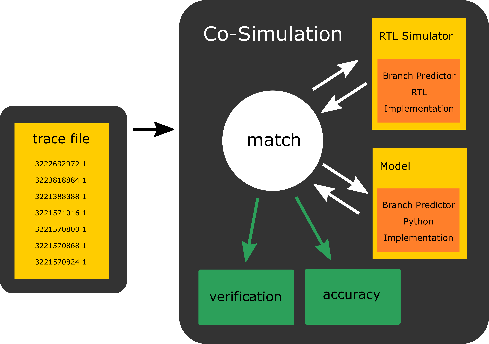
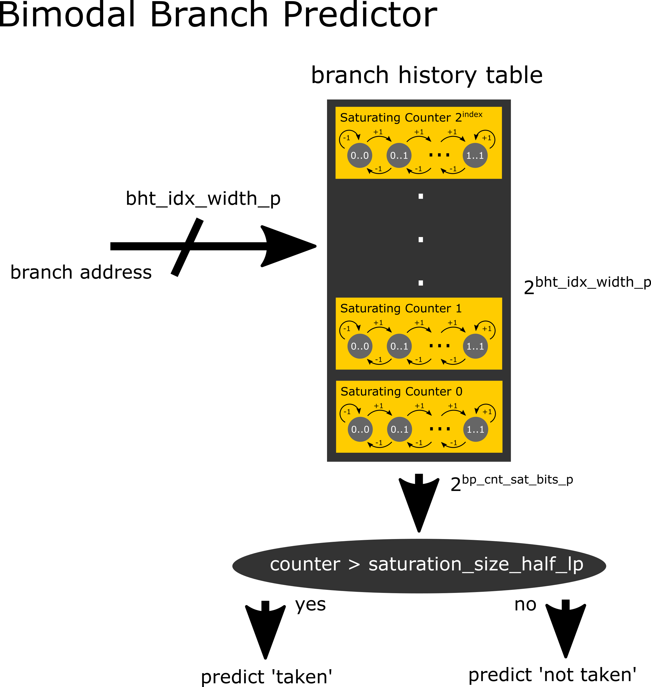
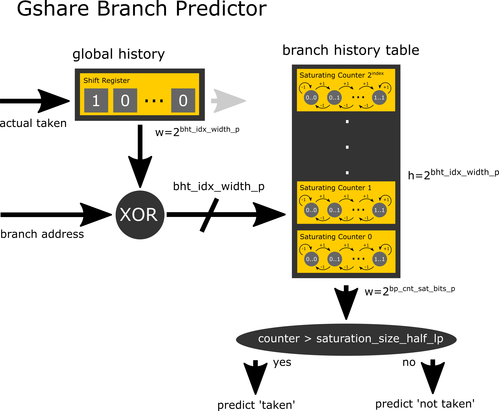
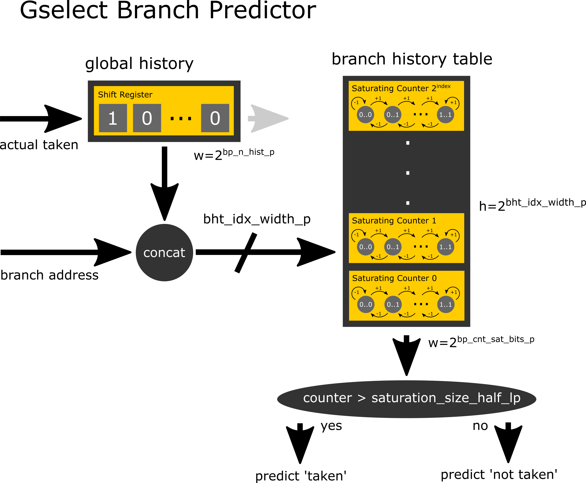
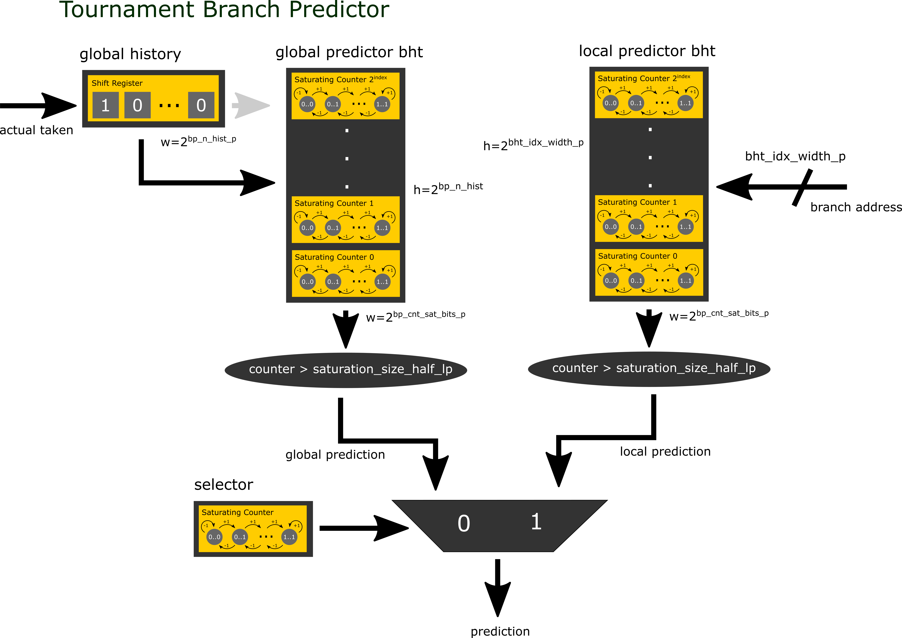
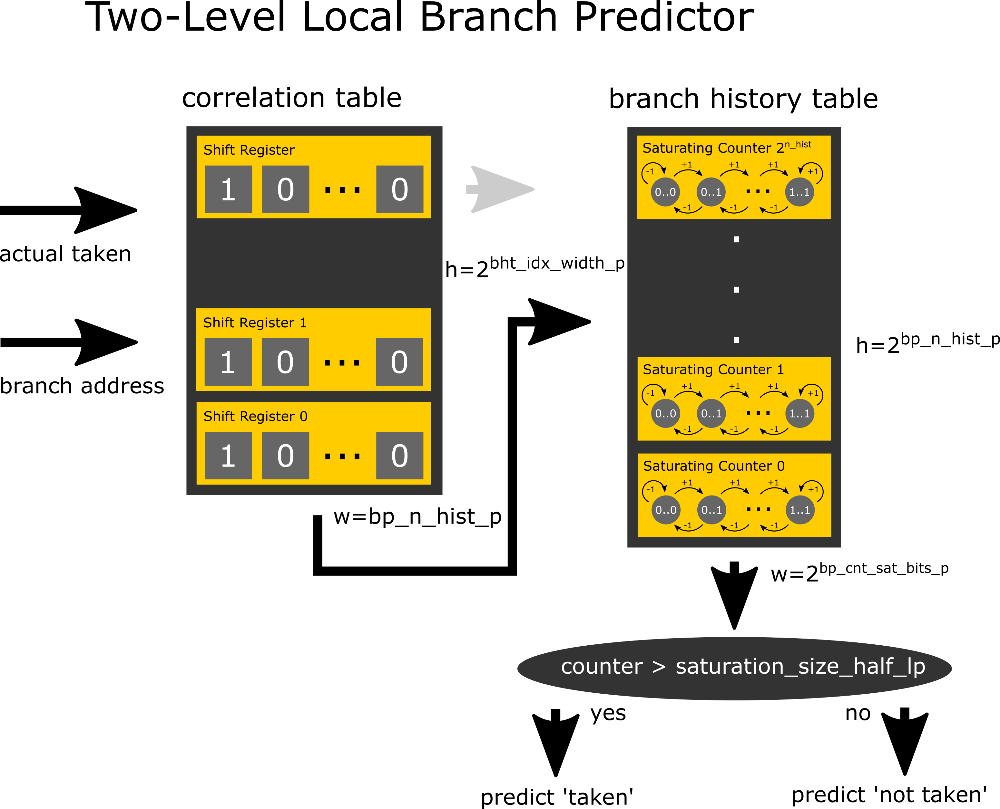
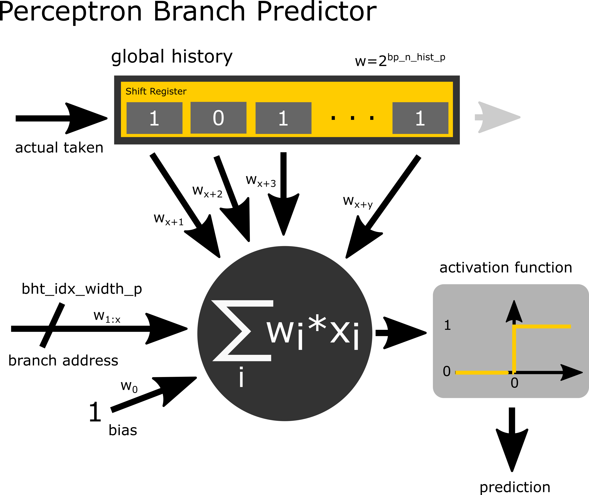
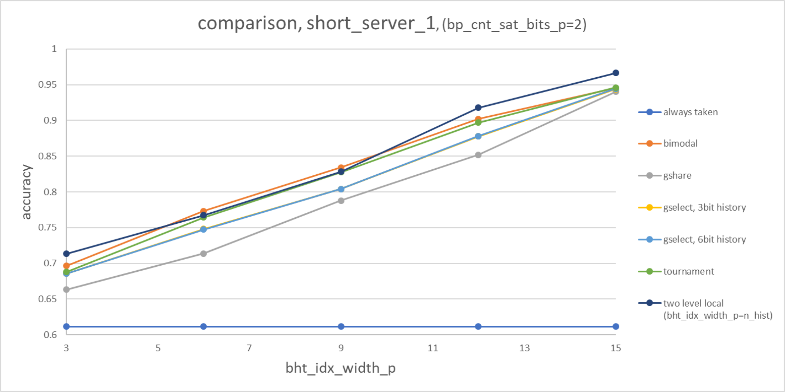
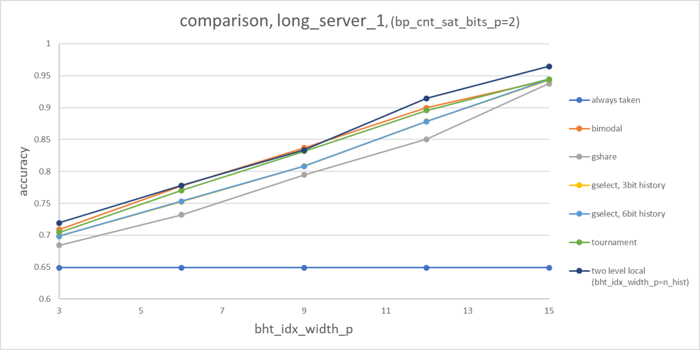
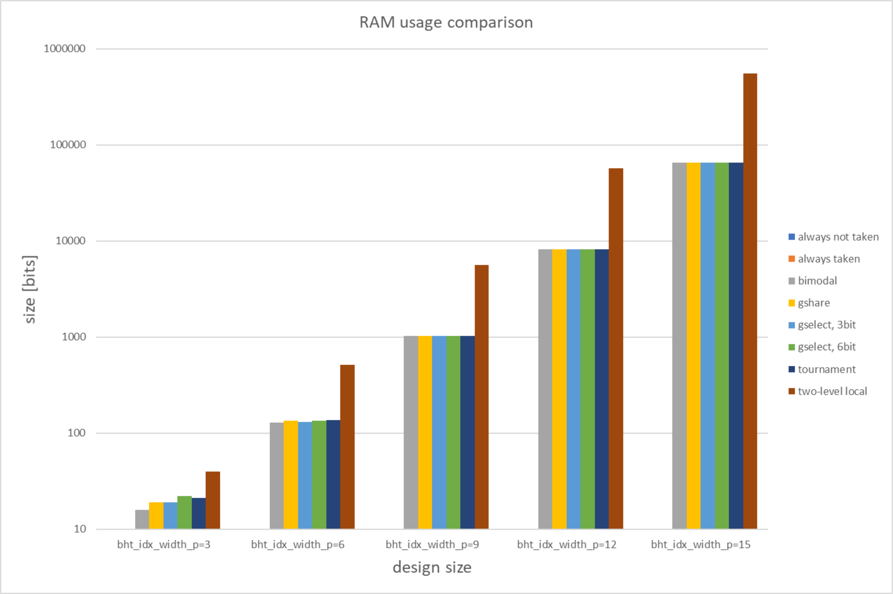

# Black Parrot Branch Predictor [](https://www.gnu.org/licenses/gpl-3.0)

## Intro
As part of our VLSI2 class at University of Washington, we seek to improve a part of the [BlackParrot](https://github.com/black-parrot/black-parrot) Open-Source RISC-V 
processor in terms of PPA (Power, Performance, Area) and/or simplicity. We decided to tackle the problem of improving the 
[branch predictor](https://en.wikipedia.org/wiki/Branch_predictor), since a better predictor can easily improve the overall
performance by reducing the number of misspredictions/revertions.

The current implementation is a fixed-width (=2) saturating counter [one-level bimodal branch predictor](https://en.wikipedia.org/wiki/Branch_predictor#One-level_branch_prediction).
In order to explore the whole design space, we generalized the imposing a adjustable saturating counter bit-width parameter
on the one hand, and by implementing different branch predictors such as always-taken, gselect, gshare, two-level local and
tournament. The major contribution is not only the RTL implementation of these predictors, but also a comprehensive study 
and comparison in terms of prediction performance and PPA between the designs.

## Setup
To gain the ability of comparison between the different implementations, we first started with the existing [test programs](https://github.com/black-parrot/black-parrot/tree/master/bp_common/test)
of black parrot, which reports the number of cycles each of the program takes ([verilator](https://www.veripool.org/wiki/verilator)
simulation). This approach comes with a couple of downsides. 

(1) Firstly, we are reporting cycles instead of accuracy (#correct predictions/#total branches).
This is problematic in multiple ways, e.g. what if the program does not contain any branches/only very few? what if the 
branches are only of a certain type?.

(2) Secondly, some of the test programs finish execution in only a few thousand cycles, while only a fraction of these cycles 
are spent on branch instructions. This drastically reduces the statistical relevance of our findings from these tests.

(3) Last but not least, since malfunctioning branch predictors only decrease the performance, but not the correct code execution
we have no notion of testing the correctness of our implementation. Recall: "Hardware is about 10x as hard to debug as 
software.", Part of Taylor's VLSI Axiom #5. In the case of a branch predictor, with a large internal state, it is even
almost impossible to write good tests by hand.

This reasoning above can be underlined well with one of our early cycle performance analysis. Even for larger tests such 
as the coremark benchmark, we even get slightly better performance (lower cycle count is better) with the primitive 
'always taken' implementation compared to the current 'bimodal' branch predictor.


In order to overcome these limitations, we developed our own performance evaluation and testing system.

After being given a hint by Professor Taylor, we started investigating the use of branch traces from the most recent
[Championship Branch Prediction CBP-5](https://www.jilp.org/cbp2016). 




## Branch Predictor Implementations

In this section, we will have a look at all branch predictor implementations, their functionality and there performance.

### Static Branch Predictors
Static branch predictors are very simple predictors used mostly in the earliest designs. They do not rely on the branch history
at runtime, but rather predict on the bases of the branch type.

### Always Not Taken
The always not taken branch predictor is a static and ultra light-weight (area, power) branch predictor. Like the name already
reveals, it simply predicts all branches as 'not taken'.

#### Conjecture:

__Accuracy__: We expect this branch predictor to perform badly, and specifically worse than its always taken counterpart. 
The reasoning is that even if "if/else" branches might work in favour for either of them, most loops are implemented in 
the following general loop scheme works strongly in favour of the 'always taken' predictor: 

C-Code:
```
    x = 0;
	while(x < 42){
		x++;
	}
```
Assembly Version
```
        jmp     .L2
.L3:
        addl    $1, -4(%rbp)
.L2:
        cmpl    $41, -4(%rbp)
        jle     .L3
```
with `x=-4(%rbp)`

You note that the conditional jump `jle` is going to be 'taken' 42 times and only once 'not taken'.

__Predictions per Cycle__: Since there is no computation involved, the implementation should be able to run at almost every frequency.

__Area__: The area usage should be almost zero.

__Power__: The power usage should be almost zero.

More detailed evaluations and the integration into black-parrot can be found:
- [Detailed evaluation](./testbench_bp_always_taken/README.md)
- [BlackParrot Integration](https://github.com/andreaskuster/black-parrot/blob/uw_ee477_pparrot_wi20_branch_predictor_01_always_not_taken/bp_fe/src/v/bp_fe_bp.v#L28)


### Always Taken

The always taken branch predictor is a static and ultra light-weight (area, power) branch predictor. Like the name already
reveals, it simply predicts all branches as 'taken'.

#### Conjecture:

__Accuracy__: We expect this branch predictor to perform worse than the dynamical branch predictors, but better than 
its always taken counterpart.  The reasoning is that even if "if/else" branches might work in favour for either of them, most loops are implemented in 
the following general loop scheme works strongly in favour of the 'always taken' predictor:

C-Code:
```
    x = 0;
	while(x < 42){
		x++;
	}
```
Assembly Version
```
        jmp     .L2
.L3:
        addl    $1, -4(%rbp)
.L2:
        cmpl    $41, -4(%rbp)
        jle     .L3
```
with `x=-4(%rbp)`

You note that the conditional jump `jle` is going to be 'taken' 42 times and only once 'not taken'.


__Predictions per Cycle__: Since there is no computation involved, the implementation should be able to run at almost every frequency.

__Area__: The area usage should be almost zero.

__Power__: The power usage should be almost zero.

More detailed evaluations and the integration into black-parrot can be found:
- [Detailed evaluation](./testbench_bp_always_taken/README.md)
- [BlackParrot Integration](https://github.com/andreaskuster/black-parrot/blob/uw_ee477_pparrot_wi20_branch_predictor_02_always_taken/bp_fe/src/v/bp_fe_bp.v#L33)

### Dynamic Branch Predictors
Dynamic branch predictors not only rely no the branch type, but also incorporate information about branch outcome at runtime.

Furthermore, the branch predictors we will see in this section can be generalised to consist of a branch history table 
(saturating counters representing the likelyhood of taking/not taking the branch, with an update mechanism) and a hash
function determining which counter to use.

### Bimodal
The bimodal branch predictor is a dynamic branch predictor and uses the lowest `bht_indx_width_p` bits as the hash function.

 

__Accuracy__: Since the bimodal branch predictor solely relies on the address bits for the hash function, we expect this
predictor to be good for workloads with very few correlation between sequential branches. For such workloads, this predictor
should show better accuracy for smaller branch history table sizes, since this hash function does not spread very widely
and therefore we expect less collisions.  

__Predictions per Cycle__: The critical path is most likely the lookup/update of the saturating counter, which should be 
reasonable fast for small branch history table sizes.

__Area__: Since the computational part of the module is rather small, we expect the area to grow almost linear with the 
size of the branch history table.

__Power__: Since the computational part of the module is rather small, we expect the power to scale almost linear with the 
size of the branch history table.

More detailed evaluations and the integration into black-parrot can be found:
[Detailed evaluation](./testbench_bp_bimodal/README.md)
[BlackParrot Integration](https://github.com/andreaskuster/black-parrot/blob/uw_ee477_pparrot_wi20_branch_predictor_03_bimodal/bp_fe/src/v/bp_fe_bp.v#L38)


### Gshare

The bimodal branch predictor is a dynamic branch predictor and uses the lowest `bht_indx_width_p` bits as the hash function.

 


__Predictions per Cycle__: The critical path is most likely from the branch history shift register through the XOR to 
the lookup/update of the saturating counter, which should be reasonable fast for small branch history table sizes.

__Area__: Since the computational part of the module is rather small, we expect the area to grow almost linear with the 
size of the branch history table plus the size of the branch history.

__Power__: Since the computational part of the module is rather small, we expect the power to scale almost linear with the 
size of the branch history table plus the size of the branch history.

More detailed evaluations and the integration into black-parrot can be found:
[Detailed evaluation](./testbench_bp_gshare/README.md)
[BlackParrot Integration](https://github.com/andreaskuster/black-parrot/blob/uw_ee477_pparrot_wi20_branch_predictor_04_gshare/bp_fe/src/v/bp_fe_bp.v#L56)


### Gselect
 


More detailed evaluations and the integration into black-parrot can be found:
[Detailed evaluation](./testbench_bp_gselect/README.md)
[BlackParrot Integration](https://github.com/andreaskuster/black-parrot/blob/uw_ee477_pparrot_wi20_branch_predictor_05_gselect/bp_fe/src/v/bp_fe_bp.v#L76)


### Tournament
 


More detailed evaluations and the integration into black-parrot can be found:
[Detailed evaluation](./testbench_bp_tournament/README.md)
[BlackParrot Integration](https://github.com/andreaskuster/black-parrot/blob/uw_ee477_pparrot_wi20_branch_predictor_06_tournament/bp_fe/src/v/bp_fe_bp.v#L95)


### Two-Level Local
 


More detailed evaluations and the integration into black-parrot can be found:
[Detailed evaluation](./testbench_bp_two_level_local/README.md)
[BlackParrot Integration](https://github.com/andreaskuster/black-parrot/blob/uw_ee477_pparrot_wi20_branch_predictor_07_two_level_local/bp_fe/src/v/bp_fe_bp.v#L113)


### Perceptron
 


This design is still __under development__. The current evaluations can be found:
[Detailed evaluation](./testbench_bp_perceptron/README.md)
[Implementation Details](./testbench_bp_perceptron)

## Findings

Generally, the problem of predicting the correct branch decision cannot be done previous to the evaluation of the
conditional branch statement (in the presence of I/O and random number generators). Furthermore, there is usually a tight
bound on the latency and resources (power/area) that are available for the implementation of such a predictor. Therefore,
all the predictors use heuristics and are greedy, which means that most likely there does not exist the best predictor, but
it is rather a balance between different tradeoffs.
These plots below provide insight into __how much information__ each of the branch predictors is capable of storing, 
given different amounts of input information (in the form of branch history, address bits). It is __important__ to note 
that the area and power requirements of different implementations might diverge significantly. For more information about
that, refer to the [theoretical power/area estimate](#theoretical-powerarea-estimate) and the findings from our backend flow.





__always taken / always not taken__:
1. The conjecture about the performance increase of the 'always taken' over the 'always not taken' holds for all traces.
2. The conjecture that the static branch predictor are more inaccurate than the dynamic branch predictors holds too.
__bimodal__:
3. We can see that the bimodal predictor has higher accuracy for small table sizes compared to gshare and gselect. 
For some of the traces the break-even point is earlier than for others. We therefore assume (unfortunately we 
cannot check this) that this is indeed due to the amount of correlation.


## Theoretical Power/Area Estimate

For this simplified power estimate model, we assume that the predictors power and area usage scales with its RAM usage. 
We think that his is reasonable, since the remaining part of the predictors above has either a 

Below you can see a table with logarithmic size axis that show how the branch history table scales.



We can conclude that the branch predictors, except the two-level local bp can e directly compared while we have to take
the better accuracy of the two-level local pb with a grain of salt, due to its high cost in terms of area/power

## Co-Simulation

1. Change into the testbench_NAME directory `cd testbench_NAME`
2. Execute the co-simulation by running `make`

In order to execute all testbenches automatically, you can run `make` in the root directory of the repo.


## Wave Form Viewer

1. Run the co-simulation first. This should generate a file `dump.vcd` in the testbench_NAME folder.
2. Open the waveform file using gtkwave `gtkwave dump.vcd`


## Prequisites

The following packages are required to run the simulation:
`sudo apt install virtualenv build-essential python3-dev gtkwave verilator libboost-all-dev`

To install all python packages, run the following command: `pip3 install -r requirements.txt`

## Reproducibility

We run our evaluation on the following system:
- `ubuntu 19.10 x86_64 kernel 5.3.0-40-generic`
- `python v3.8`
- `cocotb v1.3.0`
- `verilator v4.020 2019-10-06`
- `gcc v9.2.1`

The raw data we used for generating the plots can be found [here](./evaluation/results)

Unoptimized assembly code can be generated from C using: `gcc -S CODE.c -O0`. We added both C and assembly version 
[here](./testbench_bp_always_taken/while_assembly)

## Testing

More information about the traces can be fourn on their [official homepage](https://www.jilp.org/cbp2016/). Our traces 
are part of a large collection of training cases, which we converted using or modified [bt9 reader](./bt9_reader) to simple
traces of the form: `branch_address taken \n`. They can be found downloaded from [here](http://hpca23.cse.tamu.edu/cbp2016).

The bt9 conversion tool can be compiled using `cd bt9_reader && make` and used by executing `./bt9_reader INPUT_TRACE OUTPUT_FILE`

We used the following four traces for the evaluation with test file sizes (#branches):
- short_mobile_1.trace: 16'662'268 
- long_mobile_1.trace: 29'269'647
- short_server_1.trace: 230'692'528
- long_server_1.trace: 149'246'445


## Roadmap

Even though we tried to implement our branch predictor designs as generic as possible, we could still not incorporate all
extra tweaks and tricks we found on the web. 

We encourage people to contribute to this repo by adding additional testbenches. A few ideas for superior designs might be:

- Perceptron Branch Predictor: The first version of the model is already implemented. We have to find a good balance between
a good prediction rate and the complexity of the hardware (in terms of resources and critical path).
    - https://www.cs.utexas.edu/~lin/papers/hpca01.pdf
    - http://hpca23.cse.tamu.edu/taco/pdfs/hpca7_dist.pdf

- TAGE:
    - http://www.irisa.fr/caps/people/seznec/JILP-COTTAGE.pdf
    - https://pharm.ece.wisc.edu/papers/badgr_iccd16.pdf

- Furthermore, so far, we only used the branch address and branch history information for our branch predictions. There 
might be some headroom for improvement by appying additional heuristics such as looking at the type of branch instruction.

## Contributions
Any kind of feedback or pull requests with additional testbenches are welcome.

## Credits
- https://github.com/black-parrot/black-parrot
- https://cocotb.readthedocs.io/en/latest/index.html
- https://www.veripool.org/wiki/verilator
- https://github.com/antmicro/cocotb-verilator-build
- https://web.engr.oregonstate.edu/~benl/Projects/branch_pred/#l3
- https://en.wikipedia.org/wiki/Branch_predictor#Local_branch_prediction
- http://people.cs.pitt.edu/~childers/CS2410/slides/lect-branch-prediction.pdf
- https://medium.com/@thomascountz/19-line-line-by-line-python-perceptron-b6f113b161f3