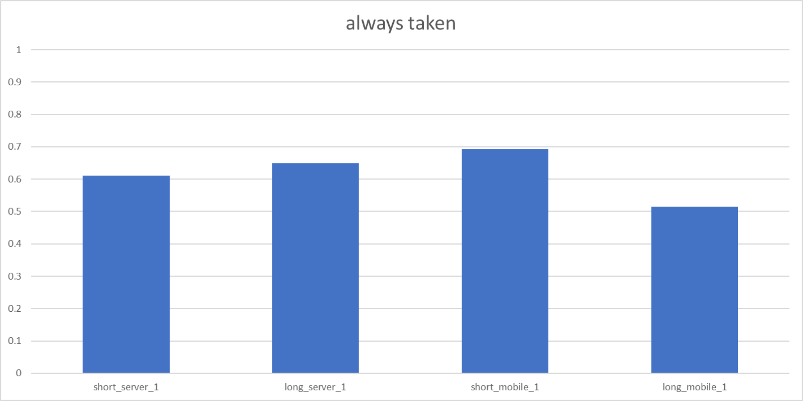
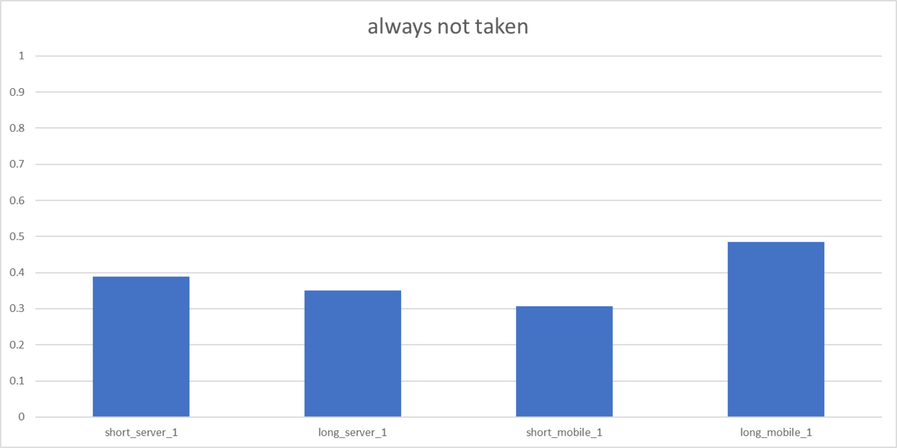

## Always Taken Evaluation

The always taken predictor performs >50% for all testcases, but sometime only with a very small margin.
This might be due to the limited amount of loops or non-standard C loop to assembly compilation.

## Always Not Taken Evaluation

Analogous to the always taken predictor, the always not taken predictor ends up with the remaining
percentage.

