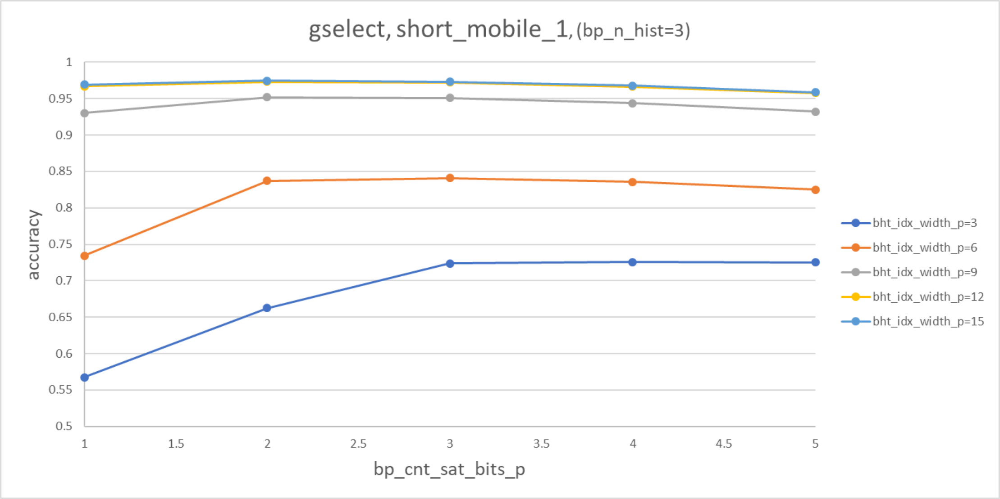
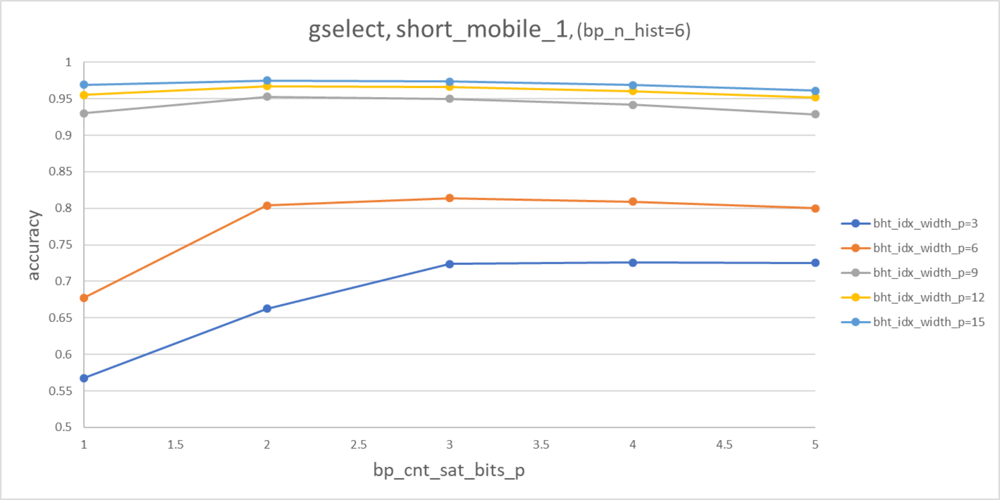
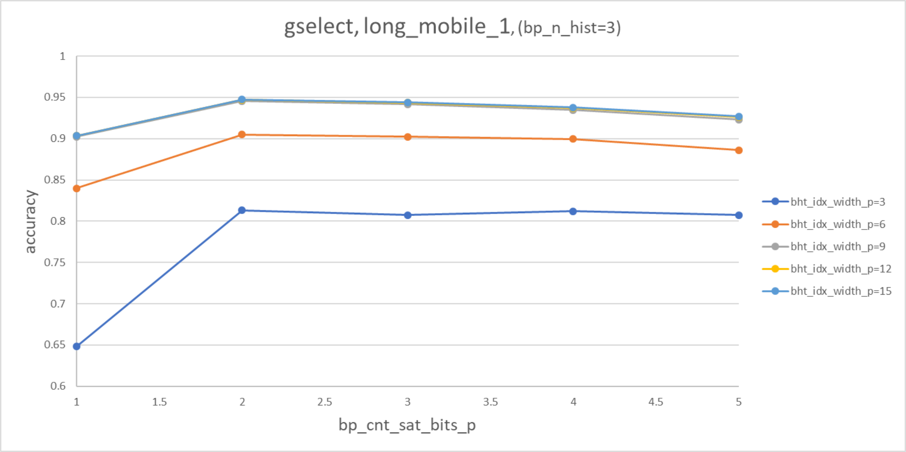
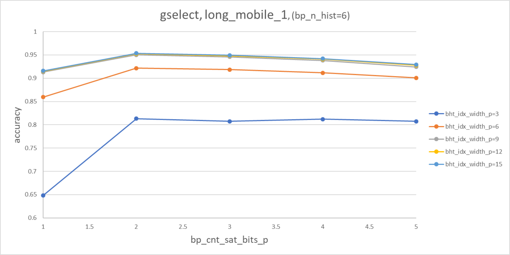
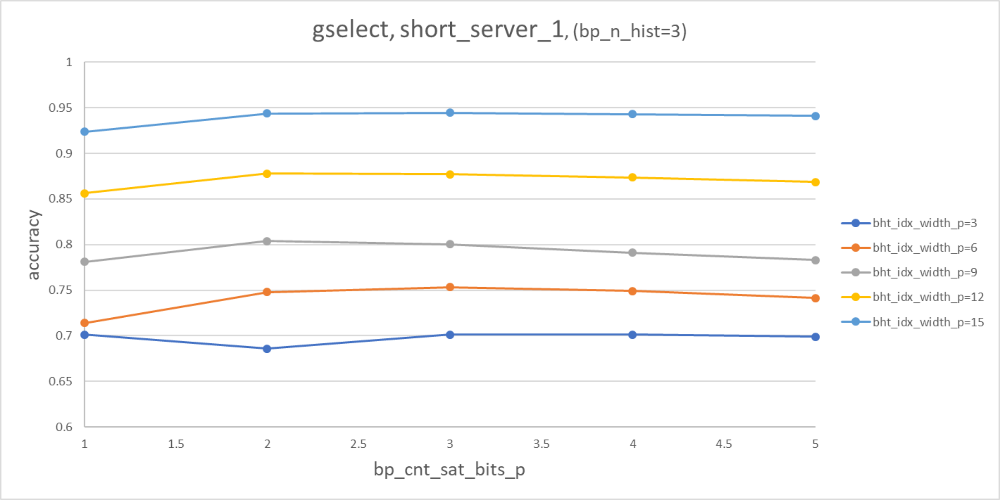
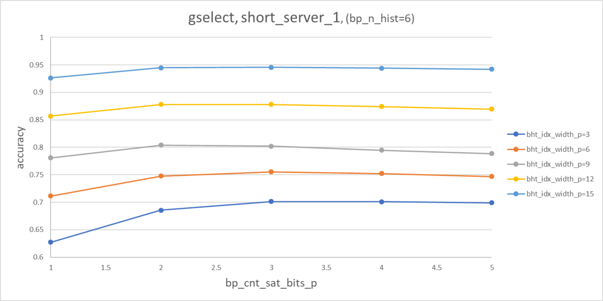
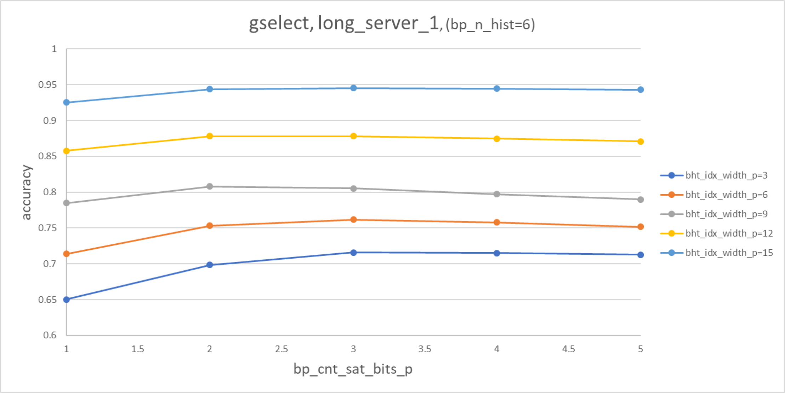
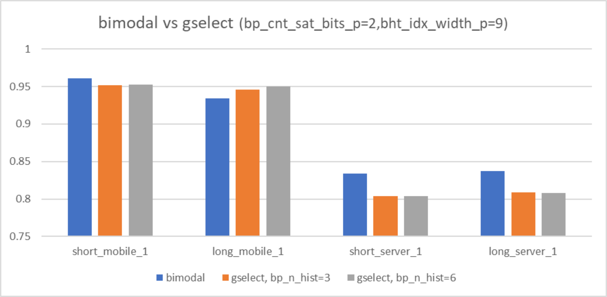

## Gselect Evaluation

Comparison with the current black-parrot implementation:

There are tree main observations:
- Saturating counters should probably have two or three bits and the get worse with more, most likely due to the longer 
learning/re-learning phase.
- The (default) behaviour of hash functions: the bigger the image size to map into, the less collisions 
and therefore the higher the accuracy.
- bp_n_hist=3 is slightly more optimal than bp_n_hist=6
